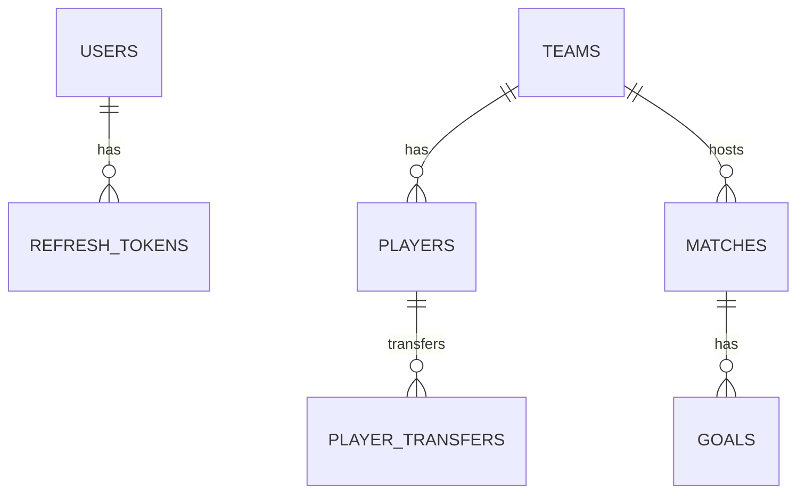

# 🏆 Football Backend API

**Football Backend** adalah RESTful API berbasis **Golang** untuk mengelola data tim, pemain, pertandingan, gol, serta autentikasi (JWT + refresh token) dengan dukungan RBAC.  

---

## 📄 Ringkasan
- Bahasa: Go (Golang)  
- Arsitektur: Handler → Service → Repository → Database  
- Autentikasi: JWT + Refresh Token  
- Roles: `ADMIN`, `STAFF`, `VIEWER`

---

## 📑 Daftar Isi
1. [Persiapan](#persiapan)  
2. [Konfigurasi Environment](#konfigurasi-environment)  
3. [Menjalankan Aplikasi](#menjalankan-aplikasi)  
4. [Import Postman Collection](#import-postman-collection)  
5. [Dokumentasi Endpoint Lengkap](#dokumentasi-endpoint-lengkap)  
6. [Format Response & Error Handling](#format-response--error-handling)  
7. [ERD (Entity Relationship Diagram)](#erd-entity-relationship-diagram)  
8. [Deployment (Docker)](#deployment-docker)  
9. [Role Access Matrix](#role-access-matrix)  
10. [Troubleshooting & FAQ](#troubleshooting--faq)  
11. [License](#license)

---

## 🔧 Persiapan
1. Clone repo:
```bash
git clone <repository-url>
cd football-backend
```
2. Install dependency:
```bash
go mod tidy
```

---

## ⚙️ Konfigurasi Environment
Salin `.env.example` ke `.env` dan sesuaikan. Contoh variabel utama:
```
APP_PORT=8080
JWT_SECRET=your-secret
DB_HOST=localhost
DB_PORT=5432
DB_USER=user
DB_PASS=pass
DB_NAME=football_db
```


---

## ▶️ Menjalankan Aplikasi
**Dev**
```bash
go run cmd/main.go
```
**Build**
```bash
go build -o football-app cmd/main.go
./football-app
```

Server default berjalan di `http://localhost:8080` (atau `{{base_url}}` sesuai environment Postman). 

---

## 📥 Import Postman Collection (cara cepat)
1. Buka Postman → Import → pilih `Football Backend API.postman_collection.json` (file Anda). 
2. Import Environment: `Football Backend Environment.postman_environment.json`.  
3. Set variable `base_url` jika perlu (default: `http://localhost:8080/api/v1`).  
4. Jalankan request `Auth → Login` untuk mendapatkan token. Skrip otomatis akan menyimpan `token` & `refresh_token` ke environment. (Script ada pada request Login & Refresh di collection). 

---

## 📘 Dokumentasi Endpoint Lengkap

### Base URL
```
{{base_url}} = http://localhost:8080/api/v1
```
(Atur di Postman Environment). fileciteturn0file0

---

### AUTH
#### POST `/auth/register`
- Deskripsi: Buat user baru.
- Body (JSON):
```json
{
  "username": "viewer2",
  "password": "secret123",
  "role": "VIEWER"
}
```
- Response (201):
```json
{
  "code": 201,
  "message": "User berhasil dibuat",
  "data": null
}
```
Contoh ada di collection `Auth → Register`. 

---

#### POST `/auth/login`
- Deskripsi: Login user. Menghasilkan `access_token` & `refresh_token`.
- Body:
```json
{
  "username": "admin1",
  "password": "123456"
}
```
- Script: Setelah sukses, Postman menyimpan token ke environment (`token` & `refresh_token`). (lihat event `test` pada request). 
- Response (200) (potongan):
```json
{
  "code": 200,
  "message": "Login berhasil",
  "data": {
    "access_token": "...",
    "refresh_token": "...",
    "user": {
      "id": 1,
      "username": "admin1",
      "role": "ADMIN"
    }
  }
}
```

---

#### POST `/auth/refresh`
- Deskripsi: Refresh access token.
- Header: `Authorization: Bearer {{token}}`  
- Body:
```json
{
  "refresh_token": "{{refresh_token}}"
}
```
- Response (200): mengembalikan access & refresh token baru. Postman script otomatis menyimpan kembali. 

---

#### POST `/auth/logout`
- Deskripsi: Revoke / logout (delete refresh token).
- Body:
```json
{
  "refresh_token": "{{refresh_token}}"
}
```
- Response: 200 atau 401 jika token tidak valid. Contoh di collection. 

---

### USER
> Role: Admin untuk sebagian besar operasi user.

- GET `/me` — ambil profil user saat ini (Authorization: Bearer {{token}}). Contoh response di collection. 

- GET `/users`  
- GET `/users/{id}`  
- PUT `/users/{id}`

(Tambahkan field sesuai DTO `user_dto.go` di project.)

---

### TEAMS
- GET `/teams` — ambil list. Response contoh ada di collection.
- POST `/teams` — buat tim.
  Body contoh:
  ```json
  {
    "name": "Barcelona",
    "logo_url": "https://example.com/logo.png",
    "year_founded": 1899,
    "address": "Camp Nou",
    "city": "Barcelona"
  }
  ```
- GET `/teams/{id}`  
- PUT `/teams/{id}`  
- DELETE `/teams/{id}`

Contoh responses tersedia in collection `Teams`. 

---

### PLAYERS
- GET `/players` — list & pagination.
- GET `/players/{id}`
- GET `/players/by-team/{teamId}`
- POST `/players` — buat pemain:
```json
{
  "team_id": 5,
  "name": "Lionel Messi",
  "height": 170,
  "weight": 72,
  "position": "PENYERANG",
  "jersey_number": 10
}
```
- PUT `/players/{id}`  
- DELETE `/players/{id}`  
- POST `/players/{id}/transfer` — transfer pemain (body: new_team_id, jersey_number)

Contoh dan kasus error seperti `409 Conflict` (nomer punggung duplicate) ada di collection. 

---

### MATCHES
- GET `/matches`  
- GET `/matches/{id}` — detail match + goals + scores (lihat sample besar di collection). 
- GET `/matches/{id}/report` — ringkasan pertandingan (report).
- GET `/matches/standing` — standing tabel.
- POST `/matches` — buat pertandingan:
```json
{
  "match_date_time": "2025-01-20T14:00:00Z",
  "home_team_id": 3,
  "away_team_id": 4
}
```
- PUT `/matches/{id}` — update status / skor dll.

---

### GOALS
- GET `/goals/match/{matchId}` — ambil semua gol pada match.
- GET `/goals/top-scorers` — top scorer.
- POST `/goals` — tambah gol:
```json
{
  "match_id": 1,
  "team_id": 2,
  "scorer_player_id": 8,
  "minute": "90"
}
```
Contoh lengkap dan sample response ada di collection `Goals`. 

---

## 🔁 Format Response Standar
Semua response mengikuti format umum:
```json
{
  "code": <http_code>,
  "message": "<message>",
  "data": <object|null>
}
```
Contoh: `{"code":200,"message":"OK","data":{...}}`  
Error: `data` biasanya `null` dan message menjelaskan error.

---

## 🧾 Error Handling & Validations (ringkasan)
- 400 Bad Request untuk input invalid  
- 401 Unauthorized untuk token invalid/expired  
- 403 Forbidden untuk akses role yang tidak cukup  
- 404 Not Found saat resource tidak ada  
- 409 Conflict untuk duplicate constraint (contoh jersey_number)  
Detail status dan pesan error dapat dilihat pada response contoh di Postman Collection. 

---

## 🧩 ERD



(ERD visual PNG bisa dibuat jika diperlukan.)

---

## 🐳 Deployment (Docker) — contoh
**Dockerfile (sederhana):**
```dockerfile
FROM golang:1.20-alpine AS build
WORKDIR /app
COPY . .
RUN go build -o football-app cmd/main.go

FROM alpine:latest
WORKDIR /root/
COPY --from=build /app/football-app .
COPY .env .
EXPOSE 8080
CMD ["./football-app"]
```

**docker-compose.yml (contoh dengan Postgres):**
```yaml
version: "3.8"
services:
  db:
    image: postgres:15
    environment:
      POSTGRES_USER: user
      POSTGRES_PASSWORD: pass
      POSTGRES_DB: football_db
    ports:
      - "5432:5432"
  app:
    build: .
    ports:
      - "8080:8080"
    depends_on:
      - db
    environment:
      - APP_PORT=8080
      - DB_HOST=db
      - DB_PORT=5432
      - DB_USER=user
      - DB_PASS=pass
      - DB_NAME=football_db
```

---

## 🔐 Role Access Matrix (ringkas)
| Endpoint                  | ADMIN | STAFF | VIEWER |
|---------------------------|:-----:|:-----:|:------:|
| /auth/*                   |  ✓    |  ✓    |  ✓     |
| /users*                   |  ✓    |  ✗    |  ✗     |
| /teams*                   |  ✓    |  ✓    |  ✓ (GET)|
| /players*                 |  ✓    |  ✓    |  ✓ (GET)|
| /matches*                 |  ✓    |  ✓    |  ✓ (GET)|
| /goals (POST)             |  ✓    |  ✓    |  ✗     |

---

## 🧪 Import & Run Collection (Postman)
1. Import collection `Football Backend API.postman_collection.json`. 
2. Import environment `Football Backend Environment.postman_environment.json`.  
3. Pilih environment, jalankan `Auth → Login` untuk set token.  
4. Gunakan folder-folder di collection (Auth, Goals, Matches, Players, Teams) untuk testing.

---

## ❗ Troubleshooting & FAQ
- **Token tidak tersimpan**: Pastikan Postman environment dipilih dan script `test` pada request Login aktif. 
- **409 saat create player**: Nomor punggung sudah digunakan di tim tersebut. Ubah `jersey_number`. 
- **DB connection refused**: Pastikan DB berjalan & `.env` sesuai.

---

## 📦 Files Postman
- Football Backend API.postman_collection.json — collection API. 
- Football Backend Environment.postman_environment.json — environment vars (base_url, token, refresh_token). fileciteturn0file0

---

## 📄 License
Lihat file `LICENSE` di repository.

---
